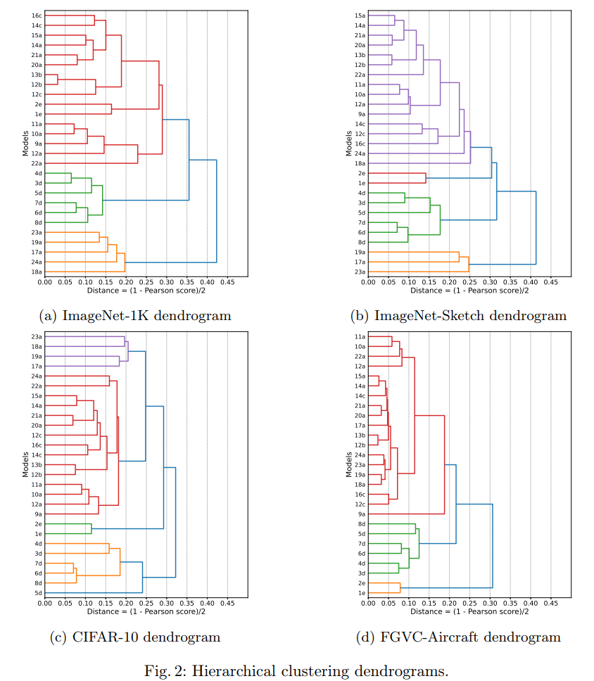
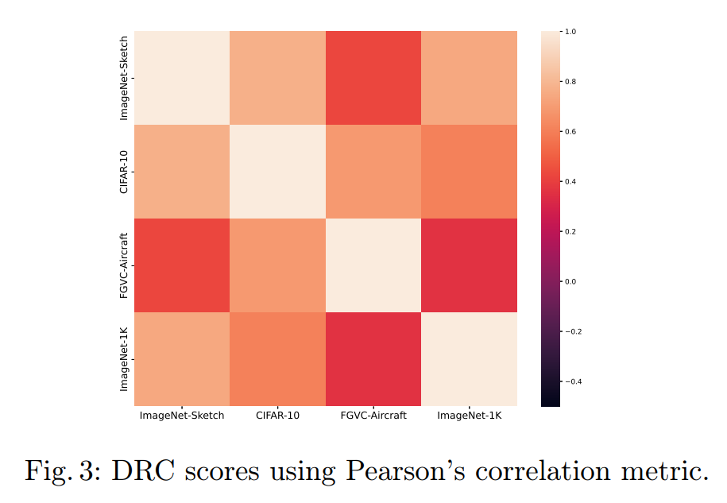
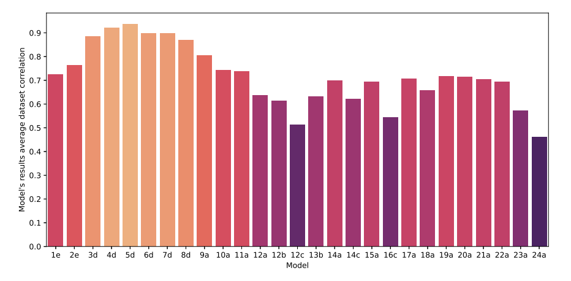

# 1. Introduction

Deep learning models have achieved remarkable performance in computer vision tasks, driven by advances in architecture design, large-scale pre-training, and the availability of massive datasets [@voulodimos2018deep]. Convolutional Neural Networks (CNNs), Vision Transformers (ViTs), and multimodal models such as CLIP now achieve high accuracy across a variety of benchmarks [@da2024evaluation; @todescato2024investigating]. However, performance metrics alone provide limited insight into how these models internally represent visual information [@raghu2021vision]. This raises a fundamental question: do modern visual models converge to similar internal representations, or do they encode fundamentally different representational structures despite achieving similar performance? Understanding this is important for model selection, transfer learning, ensemble design, robustness to domain shift, interpretability, and design of novel architectures and representation learning mechanisms.

A growing body of work has been investigating representational similarity in deep neural networks [@da2024evaluation; @kornblith2019similarity]. These studies have provided valuable insights into how representations evolve across layers and architectures. However, most existing studies focus on isolated factors, such as comparing architectures under a fixed training setup or analyzing layer-wise alignment within a single model family. As a result, the joint influence of architecture, training regime, and data domain on representational spaces remains underexplored.

In this work, we address this gap by conducting a systematic empirical investigation to analyze representational similarity across a diverse set of pre-trained visual models. Our approach combines models from different architectural families, training regimes, and scales, and evaluates them across multiple datasets with complementary properties. Using Representational Similarity Analysis (RSA) [@kriegeskorte2008representational], a framework that quantifies the similarity between systems by comparing the structure of their internal representations across shared inputs, we compare the structure of latent spaces across models, enabling a unified analysis of how representations align or diverge under varying conditions. 

To better understand the factors driving representational similarity across vision models, in this work, we investigate the following hypotheses:

- H1:Models trained under similar training regimes exhibit higher representational similarity than models sharing only architectural characteristics.

- H2: Dataset properties, such as resolution and semantic granularity, significantly modulate representational similarity across models.

- H3: Models trained with fundamentally different objectives (e.g., multimodal vs supervised) exhibit lower representational alignment, even when architecturally similar.

To evaluate these hypotheses, we conduct experiments considering 24 pre-trained models spanning CNNs, Vision Transformers, and multimodal architectures, across four datasets with distinct characteristics. Using an approach based on RSA, we identify consistent patterns of representational alignment within model families and training regimes, as well as significant variations induced by dataset properties. In particular, our results suggest that training regime and data domain have a strong influence on representational geometry, often exceeding what can be explained by architectural similarity alone.

Our main contributions are as follows: (i) a large-scale empirical analysis of representational similarity across a diverse set of modern visual models; (ii) a systematic investigation of the joint effects of architecture, training regime, and dataset domain on representation alignment; (iii) the introduction of relational stability metrics, namely Dataset Relational Consistency (DRC) and Model Relational Stability Score (MRSS), which quantify how the global organization of model relationships and the relative positioning of individual models are preserved across datasets; and (iv) empirical evidence that training and data characteristics are strongly associated with representational structure beyond architectural similarity.

The remainder of this paper is structured as follows. Section 2 reviews related work. In Section 3, we present and discuss the experiments, the adopted methodology, and the results. Finally, Section 4 exhibits the conclusions.

# 2. Related Work

In the literature, performance comparisons across different computer vision models for classification tasks have been extensively investigated [@da2024evaluation]. In many studies, the architecture is identified as the primary source of variation, motivating comparative experiments based on the similarity of internal representations [@kornblith2019similarity; @zhou2024rethinking]. To this end, metrics such as Centered Kernel Alignment (CKA) [@kornblith2019similarity] and Relation-Centered Kernel Alignment (RCKA) [@zhou2024rethinking] were introduced to evaluate the alignment of internal layer representations across different vision models. Beyond kernel-based approaches, other investigations leverage canonical correlation methods, such as Singular Vector Canonical Correlation Analysis (SVCCA) [@raghu2017svcca], which enables systematic comparisons across distinct architectures.

In this scenario, Representational Similarity Analysis (RSA) has also emerged as a significant tool. Originally proposed in cognitive neuroscience [@kriegeskorte2008representational], the technique was developed to compare internal representations across systems---such as human brains and computer models---regardless of the shape or dimension of these representations. This property makes RSA particularly suitable for conducting a comparative analysis of heterogeneous deep learning models.

Several studies have applied Representational Similarity Analysis (RSA) in artificial intelligence to investigate the structure of learned representations. For example, [@khaligh2014deep] uses RSA to compare representations from deep neural networks with human neural data, examining how closely vision models resemble the biological visual system. In computer vision, [@raghu2021vision] employs RSA to quantify similarities across different architectures and layers within the same model.

Despite these advances, the joint influence of factors such as architecture, training methodology, model scale, and data domain remains underexplored. Prior work typically examines representational similarity under controlled settings, focusing on a single dimension. In this context, our work investigates how these factors interact to shape the representational space of pre-trained models. Rather than isolating individual aspects, we analyze similarity patterns across a diverse set of models evaluated under different visual domains.

# 3. Experiments

This Section presents the experimental setup used to analyze the internal representations of modern computer vision models and examines the results. We begin by describing the datasets and model architectures considered in this study. Next, we outline the evaluation methodology. Finally, we present and discuss the experimental findings.

## Datasets

We selected four datasets with complementary properties: ImageNet-1K [@deng2009imagenet], ImageNet-Sketch [@wang2019learning], CIFAR-10 [@krizhevsky2009learning], and FGVC-Aircraft [@maji2013fine]. Table 1 presents the main characteristics of each. While ImageNet-1K and ImageNet-Sketch share an identical set of semantic classes, their visual domains differ substantially. This contrast enables us to examine how changes in visual characteristics---such as the absence of color and the stylized representation of structure---affect the models' latent representations. In addition to this controlled comparison, the selected datasets capture a range of visual scenarios. CIFAR-10 provides a low-resolution setting with a limited number of classes, while FGVC-Aircraft represents a fine-grained classification scenario, where categories are visually similar and differ in subtle details, making class boundaries harder to distinguish. Together, these datasets enable the analysis of representational behavior under varying domain properties.

<table>
  <caption>Table 1: Characterization of datasets</caption>
  <thead>
    <tr>
      <th>Dataset</th>
      <th>Instances</th>
      <th>Classes</th>
    </tr>
  </thead>
  <tbody>
    <tr>
      <td>ImageNet-1K [@deng2009imagenet]</td>
      <td>1431167</td>
      <td>1000</td>
    </tr>
    <tr>
      <td> FGVC-Aircraft [@maji2013fine]</td>
      <td>10000</td>
      <td>100</td>
    </tr>
    <tr>
      <td>ImageNet-Sketch [@wang2019learning]</td>
      <td>50000</td>
      <td>1000</td>
    </tr>
    <tr>
      <td>CIFAR-10 [@krizhevsky2009learning]</td>
      <td>60000</td>
      <td>10</td>
    </tr>
  </tbody>
</table>

## Pre-trained models

To conduct this study, we selected a diverse set of pre-trained neural networks, including widely used models from the PyTorch [@pytorch2019] ecosystem, as well as architectures based on DINOv3 [@simeoni2025dinov3], CLIP [@radford:21], and OpenCLIP [@cherti2023reproducible]. This set spans a broad range of architectural families, including classical and modern CNNs, Vision Transformers, and hybrid architectures. It also encompasses different training datasets and strategies, such as supervised, self-supervised, and multimodal approaches. By combining diversity in both architecture and training methodology, this model set allows us to investigate how these factors influence the organization of representational spaces. Table 2 presents the names, number of parameters, and architecture of the models. The number in the first column of the table will be used as an ID to reference the model later in this paper.

<table>
  <caption>Table 2: Pre-trained models characterization. The acronyms "CNN", "Tr", and "CNN + Tr" indicate, respectively, Convolutional Neural Networks, Vision Transformers, and Hybrid models.</caption>
  <thead>
    <tr>
      <th>#</th>
      <th>Model</th>
      <th>Params</th>
      <th>Arch</th>
      <th>#</th>
      <th>Model</th>
      <th>Params</th>
      <th>Arch</th>
    </tr>
  </thead>
  <tbody>
    <tr>
      <td>1</td>
      <td>DINOv3 ViT-B [@simeoni2025dinov3]</td>
      <td>86M</td>
      <td>Tr</td>
      <td>13</td>
      <td>RegNetY-32GF [@radosavovic2020designing]</td>
      <td>145M</td>
      <td>CNN</td>
    </tr>
    <tr>
      <td>2</td>
      <td>DINOv3 ViT-L [@simeoni2025dinov3]</td>
      <td>300M</td>
      <td>Tr</td>
      <td>14</td>
      <td>ViT-B/16 [@dosovitskiy2020image]</td>
      <td>87M</td>
      <td>Tr</td>
    </tr>
    <tr>
      <td>3</td>
      <td>CLIP ViT-B/32 [@radford:21]</td>
      <td>151M</td>
      <td>Tr</td>
      <td>15</td>
      <td>ViT-L/16 [@dosovitskiy2020image]</td>
      <td>304M</td>
      <td>Tr</td>
    </tr>
    <tr>
      <td>4</td>
      <td>CLIP ViT-B/16 [@radford:21]</td>
      <td>150M</td>
      <td>Tr</td>
      <td>16</td>
      <td>ViT-H/14 [@dosovitskiy2020image]</td>
      <td>633M</td>
      <td>Tr</td>
    </tr>
    <tr>
      <td>5</td>
      <td>CLIP ViT-L/14 [@radford:21]</td>
      <td>428M</td>
      <td>Tr</td>
      <td>17</td>
      <td>MaxVit-T [@tu2022maxvit]</td>
      <td>31M</td>
      <td>CNN+Tr</td>
    </tr>
    <tr>
      <td>6</td>
      <td>OpenCLIP ViT-B/32 [@cherti2023reproducible]</td>
      <td>151M</td>
      <td>Tr</td>
      <td>18</td>
      <td>ConvNeXt-T [@liu2022convnet]</td>
      <td>29M</td>
      <td>CNN</td>
    </tr>
    <tr>
      <td>7</td>
      <td>OpenCLIP ViT-B/16 [@cherti2023reproducible]</td>
      <td>150M</td>
      <td>Tr</td>
      <td>19</td>
      <td>ConvNeXt-B [@liu2022convnet]</td>
      <td>89M</td>
      <td>CNN</td>
    </tr>
    <tr>
      <td>8</td>
      <td>OpenCLIP ViT-L/14 [@cherti2023reproducible]</td>
      <td>428M</td>
      <td>Tr</td>
      <td>20</td>
      <td>Swin-T [@liu2021swin]</td>
      <td>28M</td>
      <td>Tr</td>
    </tr>
    <tr>
      <td>9</td>
      <td>ResNet-18 [@he2016deep]</td>
      <td>12M</td>
      <td>CNN</td>
      <td>21</td>
      <td>SwinV2-T [@liu2022swin]</td>
      <td>28M</td>
      <td>Tr</td>
    </tr>
    <tr>
      <td>10</td>
      <td>ResNet-50 [@he2016deep]</td>
      <td>26M</td>
      <td>CNN</td>
      <td>22</td>
      <td>EfficientNet-B0 [@tan2019efficientnet]</td>
      <td>5M</td>
      <td>CNN</td>
    </tr>
    <tr>
      <td>11</td>
      <td>ResNet-152 [@he2016deep]</td>
      <td>60M</td>
      <td>CNN</td>
      <td>23</td>
      <td>EfficientNet-B4 [@tan2019efficientnet]</td>
      <td>19M</td>
      <td>CNN</td>
    </tr>
    <tr>
      <td>12</td>
      <td>RegNetY-16GF [@radosavovic2020designing]</td>
      <td>84M</td>
      <td>CNN</td>
      <td>24</td>
      <td>EfficientNet-B7 [@tan2019efficientnet]</td>
      <td>66M</td>
      <td>CNN</td>
    </tr>
  </tbody>
</table>

Most models were pre-trained on the standard ImageNet-1K dataset [@deng2009imagenet]. A subset of models follows the IMAGENET1K_SWAG_E2E_V1 training scheme [@pytorch2019], where models are first pre-trained using the SWAG (Scaling Weakly-Supervised Learning) approach [@singh2022revisiting] and subsequently fine-tuned end-to-end on ImageNet-1K. In contrast, some models rely on alternative pre-training strategies. OpenCLIP models are trained on large-scale LAION datasets (e.g., LAION-400M [@schuhmann2021laion] and LAION-5B [@schuhmann2022laion]), while CLIP and DINOv3 are trained on large-scale non-public datasets. Table 3 summarizes the different training recipes and their corresponding methods. Each recipe is assigned a label (a--e), which is used throughout the paper for concise reference. Models are identified by combining their numerical index from Table 2 with the corresponding recipe label, indicating their base architecture and training configuration.

<table>
  <caption>Table 3: Pre-training recipes and their training types</caption>
  <thead>
    <tr>
      <th>#</th>
      <th>Training recipe</th>
      <th>Training type</th>
    </tr>
  </thead>
  <tbody>
    <tr>
      <td>a</td>
      <td>IMAGENET1K_V1 [@pytorch2019]</td>
      <td>Supervised</td>
    </tr>
    <tr>
      <td>b</td>
      <td>IMAGENET1K_V2 [@pytorch2019]</td>
      <td>Supervised</td>
    </tr>
    <tr>
      <td>c</td>
      <td>IMAGENET1K_SWAG_E2E_V1 [@pytorch2019]</td>
      <td>Weakly supervised</td>
    </tr>
    <tr>
      <td>d</td>
      <td>CLIP training [@radford:21]</td>
      <td>Self-supervised multimodal</td>
    </tr>
    <tr>
      <td>e</td>
      <td>DINOv3 training [@simeoni2025dinov3]</td>
      <td>Self-supervised</td>
    </tr>
  </tbody>
</table>
## Methodology

At the core of our study lies the application of RSA [@kriegeskorte2008representational] to compare the internal representations (embeddings) produced by different pre-trained computer vision models. RSA enables the comparison of representational spaces by analyzing how each model encodes relationships between the same set of visual stimuli.

#### Data preparation and feature extraction.

For each dataset, we construct a balanced and stratified subset containing 2000 images. These samples are evenly distributed across 100 classes, except for CIFAR-10, which contains 10 classes. For ImageNet-1K [@deng2009imagenet] and ImageNet-Sketch [@wang2019learning] (both with a total of 1000 classes), we select identical class subsets to ensure semantic alignment while allowing variation in visual properties such as texture, color, and level of detail. All images are preprocessed according to each model's requirements, including resizing, normalization, and cropping, and are represented in RGB format. Each model is used as a fixed feature extractor, with embeddings obtained from the last layer prior to classification, without any fine-tuning.

#### Representational Similarity Analysis.

For each model, we construct a Representational Dissimilarity Matrix (RDM), which captures pairwise dissimilarities between embeddings of input images. Each element of the RDM is computed using cosine distance between pairs of image embeddings. The resulting matrix reflects how the model organizes relationships among inputs and can be interpreted as a representation of the geometry of its latent space. To compare two models, their respective RDMs are vectorized by extracting only the off-diagonal elements. The similarity between models is then computed as the Pearson correlation [@Pearson1895] between these vectors. This procedure is repeated for all model pairs, yielding a Representational Similarity Matrix (RSM) for each dataset: $S^{(k)} \in \mathbb{R}^{M \times M}$, where $S^{(k)}_{i,j}$ denotes the similarity between models $m_i$ and $m_j$ on dataset $D_k$.

#### Hierarchical clustering analysis.

To further analyze how models relate to each other in the representational space, we perform hierarchical clustering based on the RSMs. Since clustering algorithms operate on distances rather than similarities, we convert similarity values into distances as follows:
$$\begin{equation}
    d_{i,j} = \frac{1 - S^{(k)}_{i,j}}{2}.
\end{equation}$$ This transformation maps correlation values from the interval \[-1, 1\] to a distance range of \[0, 1\], ensuring that higher similarity corresponds to smaller distances while preserving the relative relationships between models. The resulting distance matrix is used as input for hierarchical clustering, enabling the identification of groups of models with similar representational structures and providing a complementary view to pairwise similarity analysis.

#### Dataset Relational Consistency (DRC).

Beyond pairwise comparisons, we assess how consistently the global structure of model relationships is preserved across datasets. Let $\mathcal{M} = \{m_1, \dots, m_M\}$ be the set of models and $\mathcal{D} = \{D_1, \dots, D_K\}$ the set of datasets. For each dataset $D_k$, let $S^{(k)}$ be its corresponding RSM.

We define the relational structure of dataset $D_k$ as:
$$\mathbf{s}^{(k)} = \text{vec}_{\text{off}}(S^{(k)}),$$ where $\text{vec}_{\text{off}}(\cdot)$ extracts the upper triangular elements of the matrix, excluding the diagonal. The DRC between two datasets $D_p$ and $D_q$ is then defined as:
$$DRC(D_p, D_q) = \rho\big(\mathbf{s}^{(p)}, \mathbf{s}^{(q)}\big),$$
where $\rho(\cdot,\cdot)$ denotes a correlation function (e.g., Pearson or Spearman).

This measure quantifies how stable the global organization of models is across a pair of datasets. High values indicate that the relative relationships between models are preserved, while low values indicate that the dataset induces structural changes in the representational space.

#### Model Relational Stability Score (MRSS).

To complement the dataset-level analysis, we assess stability at the level of individual models. Using the same notation, for each model $m_i$ and dataset $D_k$, we define its *relational profile* as:
$$\mathbf{r}_i^{(k)} = \big(S^{(k)}_{i,1}, \dots, S^{(k)}_{i,i-1}, S^{(k)}_{i,i+1}, \dots, S^{(k)}_{i,M}\big),$$
which corresponds to the vector of similarities between $m_i$ and all other models in $\mathcal{M}$, excluding self-similarity. The consistency of model $m_i$ across two datasets $D_p$ and $D_q$ is then defined as the correlation between their respective relational profiles:
$$C_{m_i}(D_p, D_q) = \rho\big(\mathbf{r}_i^{(p)}, \mathbf{r}_i^{(q)}\big).$$

The Model Relational Stability Score (MRSS) of a model $m_i$, in the context of models $\mathcal{M}$ and datasets $\mathcal{D}$, is defined as the average pairwise consistency across all dataset pairs:
$$MRSS(m_i, \mathcal{M}, \mathcal{D}) = 
\frac{2}{K(K-1)} 
\sum_{1 \leq p < q \leq K} 
\rho\big(\mathbf{r}_i^{(p)}, \mathbf{r}_i^{(q)}\big).$$

Intuitively, MRSS quantifies how consistently a model preserves its pattern of similarities with respect to other models when evaluated on different datasets. High values indicate that the relative similarity relationships of $m_i$ are largely maintained across domains, while low values indicate that these relationships vary significantly, suggesting sensitivity to domain shifts.

Importantly, both DRC and MRSS are relational metrics: they depend on the set of models $\mathcal{M}$ and datasets $\mathcal{D}$ considered and therefore characterize stability within that context, rather than representing intrinsic properties of individual models in isolation.

## Results

This Section presents the evaluation of the representational dynamics of the selected models, providing empirical evidence to support our initial hypotheses. We first analyze the global representational structure through RSA. We then perform a hierarchical clustering analysis to identify groups of models with similar representational behavior. Finally, we assess the stability of these patterns across diverse visual domains, examining the influence of dataset properties.

To present the model-wise correlations, we built heatmaps using Pearson's correlation coefficient. Figures 1-4 illustrate these results across ImageNet-1K, ImageNet-Sketch, CIFAR-10, and FGVC-Aircraft, respectively.

The heatmaps reveal similar patterns across ImageNet-1K, ImageNet-Sketch, and CIFAR-10. Notably, models from the same architectural family tend to exhibit higher mutual correlation.

Furthermore, the results provide consistent empirical evidence supporting *H1*, as models with comparable architectures or training regimes tend to exhibit higher correlations. Highlighting the combined effect, CLIP and OpenCLIP models consistently exhibit high alignment across all heatmaps. Despite differences in their specific training data, their shared multimodal objective and transformer-based backbone yield correlation scores consistently above the baseline.

A notable pattern is the strong association between ViT-B/16 and Swin-T (models 14 and 20). Despite architectural differences, both models rely on transformer-based attention mechanisms, which may contribute to the observed alignment in their representations. This pattern is particularly evident in the ImageNet-1K domain (Figure 1a), suggesting that shared design components can influence representational similarity across architectures.

Despite the general alignment within architectural families, certain exceptions emerge, most notably the ConvNeXt and EfficientNet groups (Nos. 18-19 and 22-24, respectively). These models exhibit unstable behavior across the experiments; specifically, in the FGVC-Aircraft and CIFAR-10 domains (Figures 1d and 1c), they demonstrate inconsistent correlations with external architectures. Most remarkably, at least one member of the EfficientNet family presented low intra-family correlation, regardless of the dataset. This will be further investigated in future work.

In contrast, shared training regimes appear to be strongly associated with representational convergence, as posited in *H1* and *H3*. For instance, ViT-H/14 and ViT-B/16 (specifically the variants trained with recipe \"c\") align more strongly with each other than with other ViT variants. This stems from their shared weakly supervised training, distinguishing them from the supervised members of the same family. As illustrated in Figure 1b, this training-induced alignment appears to override the structural differences between \"Base\" and \"Huge\" scales.

Nevertheless, when training regimes are held constant, model scale also determines representational divergence. Within the ResNet group, we observe a consistent trend: while intra-family similarity remains generally high, representational alignment scales inversely with the disparity in model size.

Finally, the most pronounced divergence is observed in the DINOv3, CLIP, and OpenCLIP families (model nos. 1--2, 3--5, and 6--8, respectively). These groups consistently distance themselves from the broader supervised ensemble, a result that supports *H3*. While most PyTorch-based models [@pytorch2019] share similar supervision strategies and are trained on ImageNet-1K, these families rely on substantially different training paradigms, namely self-supervision and contrastive multimodal learning [@radford:21], and are also trained on distinct large-scale datasets. As a result, the observed divergence likely reflects a combination of differences in training objectives and training data. Although these results suggest that training objectives may play an important role in shaping representational structure, the present analysis does not allow us to disentangle their effect from that of the data used for training the models. This limitation highlights a relevant direction for future work.

To further analyze the relationships between models, we perform hierarchical agglomerative clustering using the average linkage criterion. The resulting clustering structures are visualized as dendrograms in Figures 2a-2d.

Beyond corroborating the pairwise similarity patterns observed in the heatmaps, the dendrograms provide insight into the hierarchical organization of models in the representational space. A key observation is that clustering occurs at multiple levels, revealing a hierarchical structure that is not directly accessible from pairwise similarities alone. Globally, models tend to group according to training factors, such as objectives and pre-training data. While these factors are intertwined in our experimental setting, the observed clustering patterns suggest that similarities in training conditions are associated with representational alignment. For example, CLIP and OpenCLIP models (3--5 and 6--8) consistently form cohesive clusters across datasets, remaining separated from other Vision Transformer-based models trained with supervised objectives. Since these models differ both in training paradigms and pre-training data, the observed separation likely reflects a combination of these factors. While this suggests that differences in training conditions are associated with distinct representational structures, the present analysis does not allow us to isolate the contribution of each factor individually. Conversely, within broader clusters, models from the same architectural family (e.g., CNN-based models) still tend to appear grouped locally, indicating that architecture contributes to finer-grained organization.

The dendrograms also highlight that relationships between model properties and representational similarity are not strictly monotonic. Within the ResNet family, for instance, models \"10a\" and \"11a\" exhibit a stronger association than \"9a\" and \"10a\", despite larger differences in scale. This suggests that increasing model capacity does not necessarily lead to progressively more aligned representations, indicating a more complex relationship between scale and representational similarity.

Importantly, the hierarchical structure is not stable across datasets. In CIFAR-10 [@krizhevsky2009learning] and FGVC-Aircraft [@maji2013fine], the dendrograms exhibit a more compressed structure, with reduced separation between clusters relative to ImageNet-1K. This suggests that dataset characteristics---such as lower resolution and fine-grained distinctions---may constrain the diversity of learned representations, making models more similar to each other. This observation is consistent with the reduction in representational distances discussed previously, while providing a structural interpretation of this effect.

Additionally, some models exhibit variability in their clustering position across datasets. For instance, models such as \"9a\" do not consistently maintain proximity to other members of their architectural family, shifting their position depending on the dataset. This behavior indicates sensitivity to domain characteristics and suggests that certain architectures or training configurations may lead to less stable representational structures.

In this context, FGVC-Aircraft and ImageNet-1K exhibit contrasting behaviors in the heatmaps (Figures 1d and 1a). In FGVC-Aircraft, the dataset's fine-grained nature, characterized by high visual similarity between classes, appears to constrain the space of discriminative features, leading to more aligned embeddings across models. In contrast, ImageNet-1K shows comparatively lower correlations. As most models are pre-trained or fine-tuned on this dataset, they may develop distinct, architecture-dependent feature representations that support fine-grained discrimination across a wide variety of categories. This results in more diverse representational structures and, consequently, lower alignment between models. These observations suggest that representational similarity is modulated by the evaluation domain, supporting *H2*.

Figure 3 summarizes the DRC results using Pearson's correlation. The results align with the expected impact of domain specificity: since models exhibit a notably distinct behavior on FGVC-Aircraft, it is anticipated that this would yield lower global correlations, especially when compared to the ImageNet-1K data. CIFAR-10 occupies a middle ground; while it demonstrates higher overall correlations than the ImageNet-derived datasets due to resolution constraints, it still maintains a degree of similarity with ImageNet-Sketch. This result is consistent with the hypothesis that lower image resolution reduces the amount of visual information available to all models, leading to more similar internal representations across architectures.

To assess the stability of individual combinations of architecture and training across different visual domains, Figure 4 illustrates MRSS values using the correlation metric adopted for this study.

The MRSS analysis provides a complementary perspective on how consistently each model preserves its representational structure across datasets. A first notable observation is the high stability exhibited by CLIP-based models. Despite being trained on different datasets, both CLIP and OpenCLIP variants show consistently high MRSS values, suggesting that their shared training objective and architectural design induce stable representational patterns across domains. This behavior is consistent with *H1*, reinforcing the role of training regime in shaping representational alignment.

In contrast, models associated with training recipe \"c\" tend to exhibit lower MRSS values, indicating greater variability across datasets. This suggests that certain training configurations may lead to representations that are more sensitive to domain characteristics. A closer inspection reveals a subset of models---namely \"12c\", \"16c\", \"23a\", and \"24a\"---that display comparatively lower stability. While the underlying causes are not directly assessed in this study, these patterns may be related to differences in training strategies or architectural design choices.

Overall, these results suggest that both training configuration and architectural design can influence not only representational alignment, but also its stability across domains.

# 4. Conclusion

This work presented a systematic comparison of internal representations in modern computer vision models, with the goal of understanding which aspects of neural network design most strongly influence their latent spaces. In addition, we investigated how these representations align across diverse visual domains, providing a broader view of representational behavior beyond traditional performance metrics.

Overall, our findings support the proposed hypotheses, indicating that  training regime and data domain play an important role in shaping  representational geometry, while architectural similarity alone is  insufficient to explain the observed alignment patterns. The analysis  shows that factors beyond architecture---most notably pre-training  strategies and training dataset characteristics---are central to  producing consistent and structured internal representations.  Furthermore, the results highlight the substantial impact that visual  context exerts on how models organize and encode information.

Despite these insights, our study remains primarily empirical and opens several directions for future work. We plan to extend this analysis by introducing additional similarity metrics and investigating the effects of controlled perturbations, such as noise and distortions, on representational stability. Moreover, future studies will focus on isolating the contributions of architecture, training regime, and dataset in a more controlled manner. Expanding the set of analyzed models to include a wider range of architectures and pre-training strategies is also a natural next step.

### Acknowledgements

The authors would like to acknowledge Petrobras and the Brazilian
National Agency of Petroleum, Natural Gas and Biofuels (ANP) for their
financial support of the project SAGA through cooperation agreement No.
0050.0131292.25.9 (SIGITEC 2024/00163--1). This research was supported
in part by CAPES, Finance Code 001, and by the Brazilian National
Council for Scientific and Technological Development (CNPq), Grant No.
313367/2025-6.

### Disclosure of Interests

The authors have no competing interests to declare that are relevant to
the content of this article.
